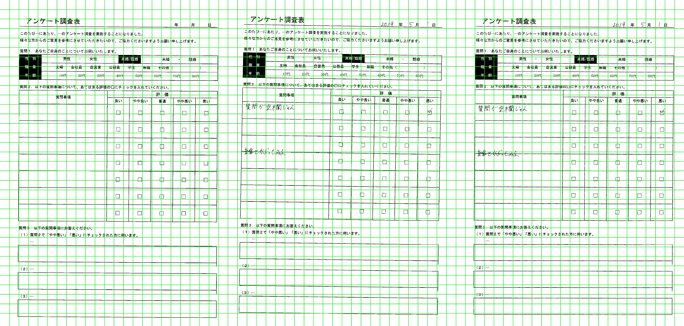
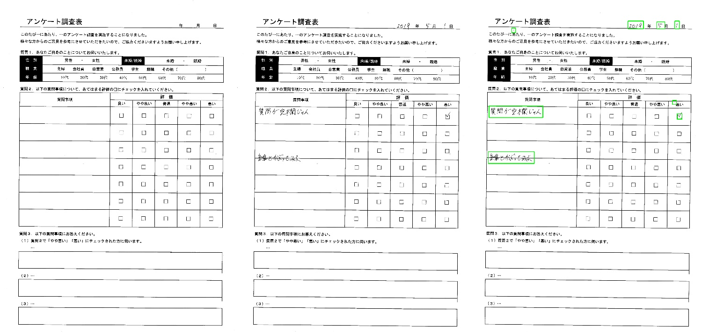
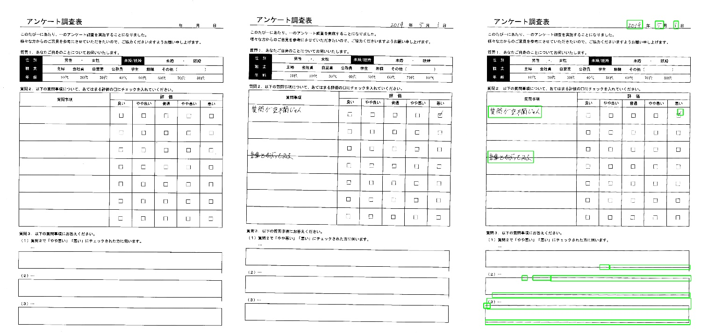

# shift_modify_detector
画像処理を用いてスキャン時のズレを修正したり、テンプレート画像からの差分を抽出するプログラムです。スキャンしてOCRで読み取りRPAで
データを保存する際に、スキャンずれで読み取り精度が下がってしまうことの対策として使用します。また、テンプレート画像(未記入の帳票)と、
記入済み帳票とのずれがなければ、画素の差分が記入箇所になるはずなので、記入箇所を自動で抽出できないか検証しています。

# 注意事項
未リファクタリング・未pytestなソースはdevelopブランチに格納しています。ご利用の際は注意してください。(ソース読むだけで不快になる可能性大です。。。)

## スキャンずれ修正
テンプレート画像をベースにしてPOC, RIPOCを用いてスキャン時のずれを修正します。OCRサービスではテンプレート画像を元に
読み取り座標を指定する場合もありますが、スキャン時にずれが生じると、座標が変わってしまいます。そのためテンプレート画像を元に
ずれ修正することで読み取り精度向上が見込めるのではないでしょうか。下記は「テンプレート画像、記入済み画像、ズレ修正した画像」です。
  

### 使用法
リファクタリング等終了後記載。リファクタリング前のものはdevelopブランチのshift_modification.pyを「--help」付きで実行すれば使用法が表示されます。

## 画像差分抽出
テンプレート画像が未記入の帳票で、記入済み帳票と画素の差分を取れば記入箇所が抽出できるはずです。実際はスキャンずれの際に紙に歪みが
生じるため、記入箇所のみ抽出することはほぼ不可能です。ですが、dilation, erosionといった画素の膨張・縮小と差分抽出を組み合わせることで
多少の歪みを無視することができます。(その代わり、膨張・縮小の度合い等パラメータが増えてしまうため、パラメータ調整は必要となります)。
下記は頑張ってパラメータ調整した結果です。紙の歪みが小さい場合は大丈夫ですが、歪みが大きいとパラメータ調整では対応できないので家庭用プリンタ
についている手差しだと厳しいです。
  

